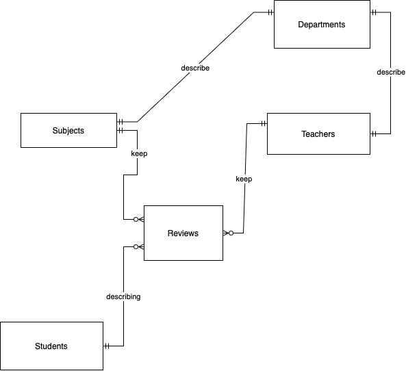

# Тема проекта
В этом проекте реализована база данных, являющая собой аналог вики мипта. Где собраны отзовы студентов и информация о преподавателях
## Первичные сущности

1) Предмет
2) Кафедра
3) Преподаватель
4) Студент
5) Отзыв

## Итоговые сущности

1) Предмет
2) Кафедра
3) Преподаватель
4) Студент
5) Отзыв
6) история отзывов

## Модели

# concept_model

 

# logic_model

[logic_model](https://gitlab.atp-fivt.org/db2024s/abdullabekovma-project/-/tree/dev/docs/logic_model.drawio.pdf)

Логическая модель переводит нашу схему в 2NF, то есть у нас у каждой таблицы есть PK, также опишем версионирование. В схеме существует таблица ReviewHistory, которая есть таблица с версионными данными, она отличается от таблицы Reviews тем, что хранит время когда был написан комментарий, а также сохраняет часть отзыва, которая была удалена, то есть это есть то, что делает таблицу версированной, в одном варианте сохраняются удалённые отзовы, в другом нет

# phisic_model

[phisic_model](https://gitlab.atp-fivt.org/db2024s/abdullabekovma-project/-/tree/dev/docs/phisic_model.md)

## Скрипты

ниже приведена ссылка на папку со скриптами

[scripts](https://gitlab.atp-fivt.org/db2024s/abdullabekovma-project/-/tree/dev/sql-scripts)
